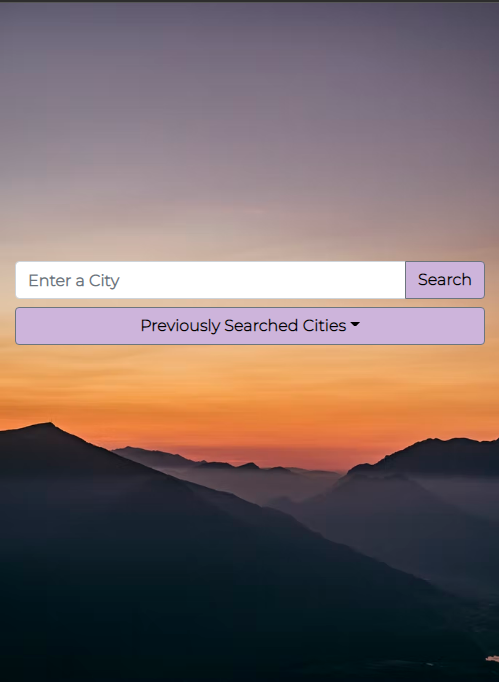
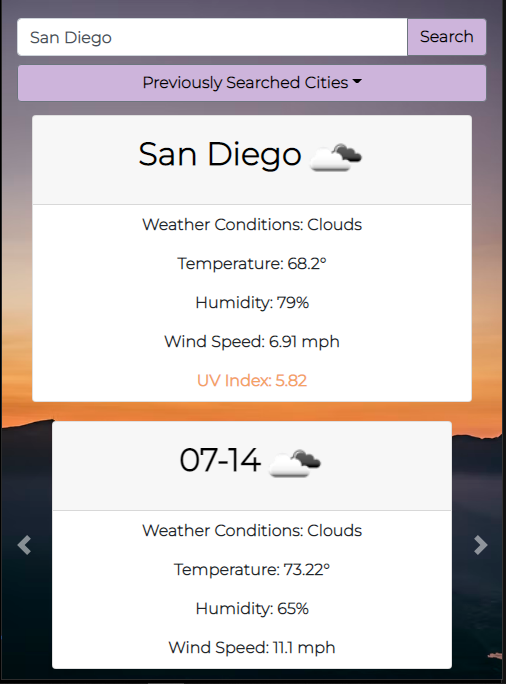
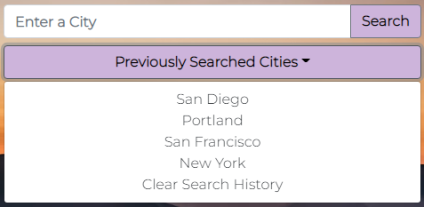

# Weather-Dashboard-App
 
Welcome to my [Weather Dashboard App!](https://cagatin.github.io/Weather-Dashboard-App/#)  

## What does this do?
  
This app enables users to view the current weather in a specified city, along with a five day forecast of future weather data. The 5 Day Forecast information is stored within an automatically scrolling carousel. 

Key weather data includes:
- Weather Condition
- Temperature
- Humidity
- Wind Speed
- UV Index

 

## Storage
Should the user want to return to a previously searched city, the user can click the 'Previously Searched Cities' dropdown menu to access their search history.  

Should the user want view the weather information, the user can simply the 'Search' button to display the data.   

  